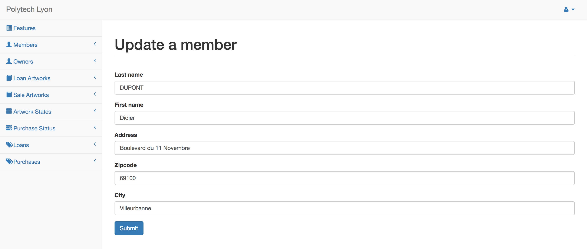
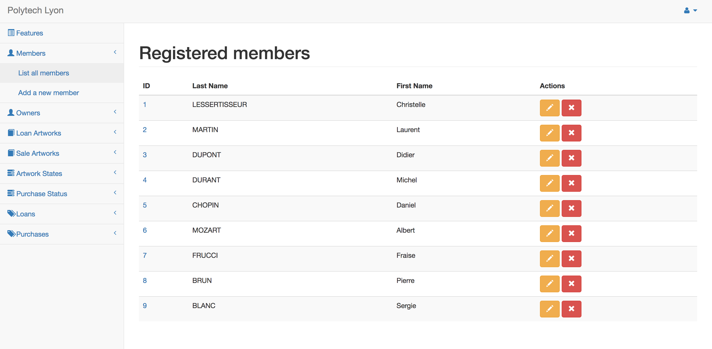

# Polytech-Oeuvres

<b>General Information</b>
 
<table>
  <tr>
    <td><b>Langage</b></td>
    <td>Java 8</td>
  </tr>
  <tr>
    <td><b>IDE</b></td>
    <td>Eclipse</td>
  </tr>
  <tr>
    <td>
      <b>Libraries</b>
    </td>
    <td>
      <ul>
        <li>hibernate-entitymanager</li>
        <li>hibernate-validator</li>
        <li>javax.el-api</li>
        <li>javax.el</li>
        <li>mysql-connector-java</li>
        <li>javax.servlet-api</li>
        <li>jstl</li>
      </ul>
    </td>
  </tr>
</table>

 

<b>Screenshot(s)</b>
 
<table>
  <tr>
    <td></td>
  </tr>
  <tr>
    <td></td>
  </tr>
</table>
